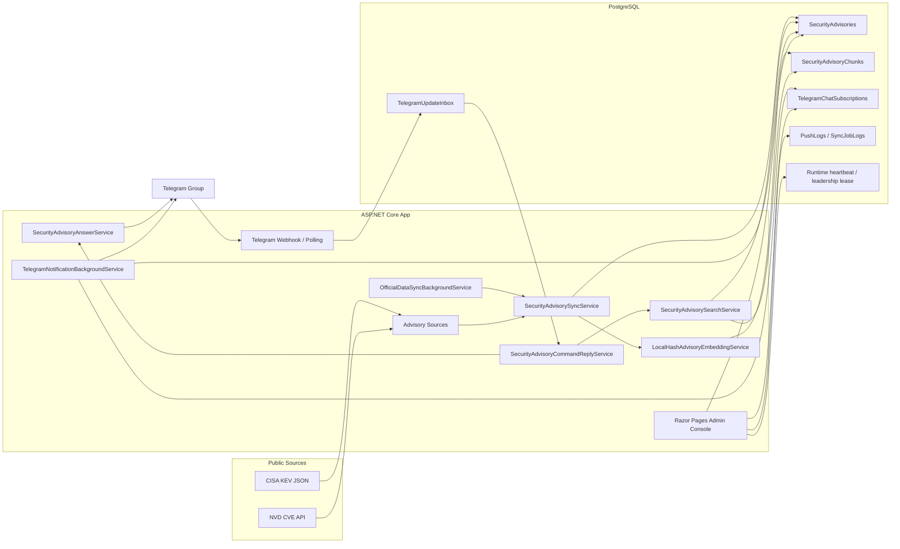

# Security Advisory Bot

以 **ASP.NET Core / Razor Pages / EF Core / PostgreSQL / Telegram Bot** 打造的輕量資安情報通知系統。

系統會同步公開弱點來源，整理成可查詢的 advisory 資料，建立 lightweight RAG 索引，並依照 Telegram chat 的訂閱規則推送高風險或已知遭利用的弱點。

Bot 會同步 CISA KEV 和 NVD 的弱點資料，正規化成統一的 SecurityAdvisory 格式，產生摘要和建議處置方向，然後透過 Telegram 讓你查詢或訂閱特定關鍵字的推播通知。


## 架構圖



## 主要功能

- 同步 CISA KEV 已知遭利用弱點
- 同步 NVD 最近更新的 CVE
- 正規化弱點資料到 `SecurityAdvisory`
- 產生簡短摘要、風險描述與建議處置方向
- 建立 `SecurityAdvisoryChunk` 作為 lightweight RAG 檢索資料
- Telegram 指令查詢最新弱點、Critical 弱點、KEV 弱點
- Telegram `/ask` 使用 RAG 從已同步資料回答問題
- Telegram chat 可訂閱關鍵字，例如 `fortinet`, `azure`, `windows`
- 後台可查看 advisories、RAG chunks、訂閱設定、sync logs、push logs、runtime 狀態
- 使用 leadership lease 避免多節點部署時重複執行 sync / push job

## Telegram 指令

```text
/latest
/latest fortinet
/critical
/kev
/explain CVE-2024-3094
/ask 最近 Fortinet 有哪些已知遭利用的弱點？
/subscribe fortinet azure windows
/unsubscribe fortinet
/watchlist
/sync
```

## RAG 設計

目前 RAG 維持輕量：

```text
CISA / NVD
  -> SecurityAdvisory
  -> SecurityAdvisoryChunk
  -> local hash embedding
  -> cosine retrieval
  -> grounded Telegram answer with source URLs
```

第一版刻意不直接導入 Dify、LangChain、Weaviate 或 Qdrant。原因是這個專案的重點是 advisory ingestion、通知規則、Telegram UX、後台管理和部署營運，而不是展示一個大型 AI 平台。

後續如果資料量或檢索品質需要提升，可以把 embedding store 換成：

- PostgreSQL + pgvector
- OpenSearch hybrid search
- Qdrant / Weaviate

## 技術棧

- .NET / ASP.NET Core
- Razor Pages
- EF Core
- PostgreSQL
- Telegram Bot API
- BackgroundService workers
- Docker / Linux deployment
- Runtime heartbeat and leadership lease

## 本機執行

### 1. 還原套件

```powershell
dotnet restore
```

### 2. 設定資料庫

沒有 connection string 時，開發環境會使用 in-memory database。若要接 PostgreSQL：

```powershell
dotnet user-secrets set "ConnectionStrings:DefaultConnection" "Host=localhost;Port=5432;Database=security_advisory_bot;Username=postgres;Password=your-password"
```

### 3. 設定 Telegram Bot

```powershell
dotnet user-secrets set "TelegramBot:Enabled" "true"
dotnet user-secrets set "TelegramBot:BotToken" "your-bot-token"
```

### 4. 套用 migration

```powershell
dotnet ef database update
```

### 5. 啟動

```powershell
dotnet run
```

## Docker / Linux

正式 demo 或部署建議跑在 Linux，原因是 Docker、PostgreSQL、背景 worker 和未來可能加入的 pgvector 都比較自然。

```bash
cp .env.example .env
docker compose up -d --build
```

常用環境變數：

```text
TELEGRAM_BOT_ENABLED=true
TELEGRAM_BOT_TOKEN=
SECURITY_ADVISORIES_ENABLE_CISA_KEV_SOURCE=true
SECURITY_ADVISORIES_ENABLE_NVD_SOURCE=true
SECURITY_ADVISORIES_NVD_LOOKBACK_DAYS=7
SECURITY_ADVISORIES_MAX_NVD_RESULTS_PER_SYNC=100
ENABLE_SECURITY_ADVISORY_PUSH=true
```

## 專案文件

- [Security Advisory RAG Rework](docs/SecurityAdvisoryRag.zh-TW.md)

## 開發備註

專案主線集中在 security advisory sync、lightweight RAG query、Telegram advisory command、push rule 和 Advisories 後台。
