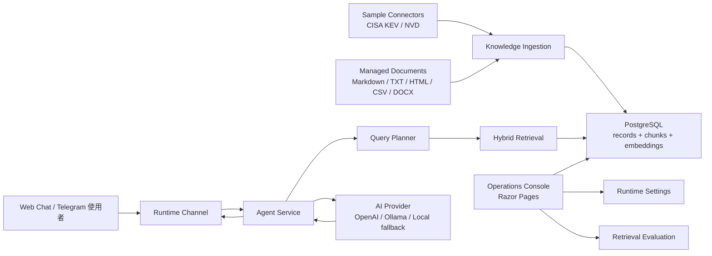

# RAG Agent Console

RAG Agent Console 是一個可換領域的 RAG Agent 平台。它把資料匯入、chunking、embedding、hybrid retrieval、answer generation、Web Chat、Telegram runtime 與營運後台放在同一個可部署範例中。

目前 repository 內建一個 cybersecurity connector（CISA KEV / NVD）作為 sample domain，讓系統一啟動就有公開、可重現的資料可測。但核心設計不是綁定資安：你可以上傳 HR policy、SOP、產品 FAQ、內部 memo、法遵文件或任何 Markdown / TXT / HTML / CSV / DOCX 文件，使用同一套 RAG pipeline 做問答。

## 專案定位

- GitHub repository：`Bikerbyte/rag-agent-console`
- Web Console 是主要營運介面，Telegram 是可選的 runtime channel。
- 使用者以自然語言提問，Agent 透過 RAG 從已索引的知識庫找到相關 context 後回答。
- AI Provider 可切換 OpenAI API、外部或本機 Ollama，或不依賴 API key 的 local fallback。
- Vector store 可使用 PostgreSQL + pgvector，並保留 EF JSON fallback。
- Agent 名稱、planner prompt、RAG system prompt、retrieval mode、AI provider 都可從 Settings 頁面調整。

## Demo Domains

內建資料分成兩類：

- **Sample connector data**：CISA KEV / NVD，匯入到 `CveAdvisory` module，適合展示公開資料同步、structured records、risk signal 與 retrieval evaluation。
- **Managed documents**：使用者上傳或貼上的文件，預設進入 `InternalDocs` 或 `WorkflowQa` module，適合展示 HR、SOP、產品文件、客服 FAQ、法遵政策等非資安情境。

非資安範例文件放在：

```text
docs/demo-corpus/onboarding-policy.zh-TW.md
```

可以在 Knowledge Base > Channels 匯入，module 選 `InternalDocs`，然後用 Retrieval Test 查詢：

```text
remote work approval
新人前三十天目標
誰負責準備第一個任務
```

## 架構



## 專案檔案結構

```text
Data/                 EF Core DbContext
Models/               EF entity、options、view model
Pages/                Razor Pages 後台介面
Services/Agent/       Agent 回覆、RAG retrieval、AI provider client、query planner
Services/Advisories/  Cybersecurity sample connector、正規化、通知派送
Services/Knowledge/   通用文件匯入、text extraction、chunking、embedding
Services/Telegram/    Telegram API、polling、webhook、update queue、push
Services/Runtime/     節點 heartbeat 與 leadership lease
Services/Settings/    後台設定覆蓋（DB 優先，fallback 到 appsettings）
Services/Contracts/   依領域分組的 service interface
```

## RAG 模組化結構

```text
資料來源          Sample connector（CISA KEV / NVD）或 managed document upload
知識庫匯入        KnowledgeDocumentIngestionService / connector sync service
Embedding         OpenAI / Ollama / local hash provider
Vector store      PgVector（建議）或 EfJson fallback
Sparse retrieval  BM25 mixed-script tokenizer
Query planner     Local heuristic planner 或 AI planner + local fallback
Retriever         Hybrid retrieval + re-ranking
Answer composer   RAG context + AI generation 或 local retrieval summary
Runtime channel   Web Chat / Telegram
```

## Retrieval Quality

專案內建 retrieval evaluation workflow，用來追蹤 RAG 檢索品質，而不是只看最終回答。

- `Evaluation/golden-set.json`：golden set 測試案例。
- `Services/Agent/Retrieval/`：mixed-script tokenizer、BM25 index、evaluation service。
- `Operations / Evaluation`：在 Web Console 執行 Hit@1、Hit@5、MRR 評估。
- Retrieval mode 支援 `Hybrid`、`Vector`、`Keyword`，方便比較 sparse / dense retrieval 的差異。

## 使用的開源與外部元件

- ASP.NET Core / Razor Pages：Web app 與營運後台
- Entity Framework Core：資料存取
- PostgreSQL：正式環境儲存
- pgvector：PostgreSQL 向量檢索 extension
- Microsoft Semantic Kernel TextChunker：通用文件 chunking
- Markdig：Markdown 文字抽取
- HtmlAgilityPack：HTML 文字抽取
- CsvHelper：CSV 文字抽取
- DocumentFormat.OpenXml：DOCX 文字抽取
- Serilog：結構化 application logging
- OpenTelemetry：HTTP / runtime tracing 與 metrics 掛點
- Telegram Bot API：聊天入口與回覆推送
- Ollama：本機或外部 GPU 主機上的 LLM 與 embedding 模型
- OpenAI API：可選用的雲端模型 provider

## AI Provider 設定

預設是 local fallback，不需要 API key，適合本機開發：

```json
"AiProvider": {
  "Provider": "Local",
  "EnableChatGeneration": false,
  "UseLocalFallback": true
}
```

OpenAI 模式：

```powershell
dotnet user-secrets set "AiProvider:Provider" "OpenAI"
dotnet user-secrets set "AiProvider:EnableChatGeneration" "true"
dotnet user-secrets set "AiProvider:OpenAiApiKey" "sk-..."
dotnet user-secrets set "AiProvider:OpenAiChatModel" "gpt-4o-mini"
dotnet user-secrets set "AiProvider:OpenAiEmbeddingModel" "text-embedding-3-small"
```

Ollama 模式：

```powershell
ollama pull llama3.1
ollama pull nomic-embed-text
dotnet user-secrets set "AiProvider:Provider" "Ollama"
dotnet user-secrets set "AiProvider:EnableChatGeneration" "true"
dotnet user-secrets set "AiProvider:OllamaApiBaseUrl" "http://localhost:11434"
dotnet user-secrets set "AiProvider:OllamaChatModel" "llama3.1"
dotnet user-secrets set "AiProvider:OllamaEmbeddingModel" "nomic-embed-text"
```

如果 app 跑在 VM，而 GPU/Ollama 跑在外部實體機，可把 `OllamaApiBaseUrl` 指到實體機 IP，例如：

```text
http://192.168.1.20:11434
```

## 本機執行

```powershell
dotnet restore
dotnet run
```

預設沒有設定 connection string 時，使用 in-memory database。

若要使用 PostgreSQL：

```powershell
dotnet user-secrets set "ConnectionStrings:DefaultConnection" "Host=localhost;Port=5432;Database=rag_agent_console;Username=postgres;Password=your-password"
dotnet ef database update
```

若要啟用 Telegram：

```powershell
dotnet user-secrets set "TelegramBot:Enabled" "true"
dotnet user-secrets set "TelegramBot:BotToken" "your-bot-token"
```

本機 polling 模式：

```powershell
dotnet user-secrets set "TelegramBot:UseWebhookMode" "false"
dotnet user-secrets set "AppRuntime:Profile" "PollingNode"
```

## Operations Console

啟動後開啟 `http://localhost:5166`（或 launchSettings.json 指定的 port）。

- **Dashboard**：知識庫與系統狀態一覽
- **Knowledge Base**：sample connector 同步、手動文件上傳、retrieval 測試
- **Chat**：直接測試 Agent 對話
- **Operations**：Telegram target 管理、推播與同步 log、節點狀態
- **Settings**：AI provider、Agent 名稱/提示詞、RAG、Telegram、排程、Observability

## Docker

```bash
cp .env.example .env
docker compose up -d --build
```

Docker Compose 的 PostgreSQL 服務使用 `pgvector/pgvector:0.8.2-pg17-trixie`。在 `.env` 選擇 OpenAI、Ollama 或 Local fallback；若要啟用 pgvector retrieval，設定：

```env
VECTOR_STORE_PROVIDER=PgVector
```

## Domain Decoupling

更多去資安耦合的設計說明見：

- [Domain Decoupling Notes](docs/DomainDecoupling.zh-TW.md)
- [Demo corpus: onboarding policy](docs/demo-corpus/onboarding-policy.zh-TW.md)

## 相關文件

- [開源元件使用清單](docs/OpenSourceComponents.zh-TW.md)
