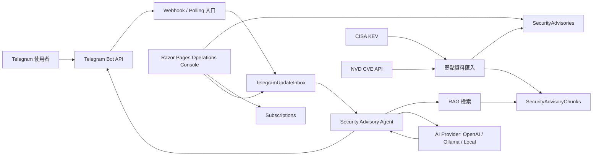

# Security Advisory Bot

Security Advisory Bot 是一個以 Telegram 為主要入口的 CVE RAG Agent。使用者可以直接用自然語言詢問弱點風險、近期廠商 CVE、CISA KEV 狀態，也可以訂閱自己關心的產品或關鍵字。

這個專案的方向不是做通用 Agent builder，而是把可替換的模型、RAG 檢索、公開弱點資料來源、Telegram Bot API 和營運後台組成一個真的能跑、能維護、能逐步擴充的資安弱點助理。

## 專案定位

- Telegram 是主要互動介面。
- 使用者以自然語言提問，不需要記任何機器指令。
- 模型可切換 OpenAI API、Ollama 本機模型，或不依賴 API key 的 local fallback。
- CISA KEV、NVD CVE 資料同步與正規化由本專案實作。
- RAG retrieval、watchlist、通知流程、營運後台都在同一個可維護的 ASP.NET Core 專案內。

## 架構



## 專案檔案禮儀

這個專案刻意維持務實的 Razor Pages / Services 結構，不套過度複雜的 Clean Architecture。資料夾的分工如下：

```text
Data/                 EF Core DbContext
Models/               EF entity、options、view model
Pages/                Razor Pages 後台介面
Services/Agent/       Agent 回覆、RAG retrieval、AI provider client
Services/Advisories/  CISA / NVD 同步、弱點正規化、通知派送
Services/Telegram/    Telegram API、polling、webhook、update queue、push
Services/Runtime/     節點 heartbeat 與 leadership lease
Services/Settings/    後台設定覆蓋 appsettings / user-secrets
Services/Contracts/   依領域分組的 service interface
```

命名原則是「看到檔名就知道責任線」。同一條流程可以有多個 service，但不把不同責任混在同一個大型檔案裡。

## RAG 模組化方向

目前 RAG 是可替換模組組合，不綁死單一平台：

```text
Data sources      CISA KEV / NVD connectors
Normalization     SecurityAdvisorySyncService
Embedding         OpenAI / Ollama / local hash provider
Vector store      IAdvisoryVectorStore，預設 EfJson，可切 PgVector
Retriever         SecurityAdvisorySearchService
Answer composer   SecurityAdvisoryAnswerService
Runtime channel   Telegram / Operations console
```

這個切法接近「自製簡化 Dify」：資料來源、embedding provider、vector store、retriever、answer composer 都有清楚邊界。現在 `ConfiguredAdvisoryVectorStore` 可以在 `EfJson` 與 `PgVector` 之間切換，後續若要新增 `QdrantAdvisoryVectorStore`、`ChromaAdvisoryVectorStore` 或其他開源向量庫實作，不需要重寫 Telegram bot 或 Agent 回答流程。

## 使用的開源與外部元件

- ASP.NET Core / Razor Pages：Web app 與營運後台
- Entity Framework Core：資料存取
- PostgreSQL：正式環境儲存
- pgvector：PostgreSQL 向量檢索 extension，Docker 環境已使用 pgvector-ready image
- Microsoft Semantic Kernel TextChunker：通用文件 chunking
- Markdig：Markdown 文字抽取
- HtmlAgilityPack：HTML 文字抽取
- CsvHelper：CSV 文字抽取
- DocumentFormat.OpenXml：DOCX 文字抽取
- Serilog：結構化 application logging
- OpenTelemetry：HTTP / runtime tracing 與 metrics 掛點
- Telegram Bot API：聊天入口與回覆推送
- CISA KEV、NVD：公開弱點資料來源
- Ollama：本機 LLM 與 embedding 模型
- OpenAI API：可選用的雲端模型 provider

## 本專案自行實作的部分

- CISA KEV 與 NVD 資料同步
- CVE / advisory 正規化
- advisory chunk 建立
- OpenAI、Ollama、local fallback embedding 串接
- RAG retrieval
- Telegram 自然語言 Agent 行為
- watchlist 管理
- Critical / KEV 通知派送
- Telegram update queue 與背景 worker
- runtime heartbeat 與 leadership lease
- Operations dashboard 與本機 Agent 測試面板

## 自然語言範例

使用者可以直接在 Telegram 輸入：

```text
CVE-2024-3094 有什麼風險？
最近 Cisco 有哪些高風險 CVE？
今天有沒有 CISA KEV 新增項目？
Fortinet 這週有沒有需要注意的漏洞？
Windows Azure Fortinet 近期有哪些 Critical 弱點？
哪些項目已經列入 CISA KEV？
```

## AI Provider 模式

預設是 local fallback。這個模式不需要 API key，適合本機開發與基本流程驗證：

```json
"AiProvider": {
  "Provider": "Local",
  "EnableChatGeneration": false,
  "UseLocalFallback": true
}
```

OpenAI 模式：

```powershell
dotnet user-secrets set "AiProvider:Provider" "OpenAI"
dotnet user-secrets set "AiProvider:EnableChatGeneration" "true"
dotnet user-secrets set "AiProvider:OpenAiApiKey" "sk-..."
dotnet user-secrets set "AiProvider:OpenAiChatModel" "gpt-4o-mini"
dotnet user-secrets set "AiProvider:OpenAiEmbeddingModel" "text-embedding-3-small"
```

Ollama 模式：

```powershell
ollama pull llama3.1
ollama pull nomic-embed-text
dotnet user-secrets set "AiProvider:Provider" "Ollama"
dotnet user-secrets set "AiProvider:EnableChatGeneration" "true"
dotnet user-secrets set "AiProvider:OllamaApiBaseUrl" "http://localhost:11434"
dotnet user-secrets set "AiProvider:OllamaChatModel" "llama3.1"
dotnet user-secrets set "AiProvider:OllamaEmbeddingModel" "nomic-embed-text"
```

## 本機執行

```powershell
dotnet restore
dotnet run
```

預設沒有設定 connection string 時，系統會使用 in-memory database，方便本機快速啟動。

若要使用 PostgreSQL：

```powershell
dotnet user-secrets set "ConnectionStrings:DefaultConnection" "Host=localhost;Port=5432;Database=security_advisory_bot;Username=postgres;Password=your-password"
dotnet ef database update
```

若要啟用 Telegram：

```powershell
dotnet user-secrets set "TelegramBot:Enabled" "true"
dotnet user-secrets set "TelegramBot:BotToken" "your-bot-token"
```

本機 polling 模式：

```powershell
dotnet user-secrets set "TelegramBot:UseWebhookMode" "false"
dotnet user-secrets set "AppRuntime:Profile" "PollingNode"
```

## Operations Console

啟動後開啟：

```text
http://localhost:5087
```

`Operations` 頁面提供同步、訂閱、節點狀態、訊息流程與 Agent 對話檢查。`Settings` 頁面集中管理 AI provider、Telegram、RAG vector store、排程與 observability 設定。

## Docker

```bash
cp .env.example .env
docker compose up -d --build
```

Docker Compose 的 PostgreSQL 服務使用 `pgvector/pgvector:0.8.2-pg17-trixie`。在 `.env` 內選擇 OpenAI、Ollama 或 Local fallback；若要啟用 pgvector retrieval，將 `VECTOR_STORE_PROVIDER=PgVector`。

## 相關文件

- [Security Advisory RAG Agent 設計說明](docs/SecurityAdvisoryRag.zh-TW.md)
- [開源元件使用清單](docs/OpenSourceComponents.zh-TW.md)
- [Ian .NET 實作風格](docs/Ian_Style_SKILL.zh-TW.md)

## MVP 驗收方向

1. 本機不設定 API key 也能啟動。
2. 可以同步 CISA KEV / NVD 資料。
3. Operations page 可以直接測試自然語言 Agent。
4. Telegram 啟用後，使用者能用自然語言查 CVE 與查廠商弱點。
5. Provider 切成 OpenAI 或 Ollama 時，回答會由模型根據 RAG context 整理。
