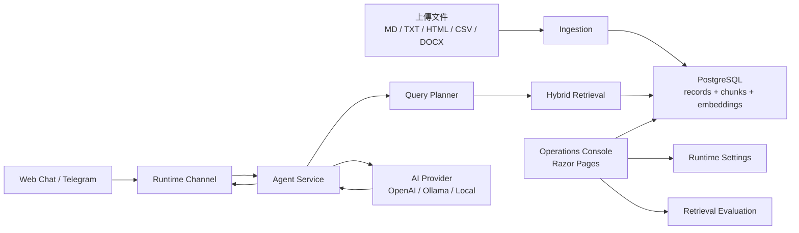

# RAG Agent Console

一個文件型 RAG AI Agent 框架，可依照知識庫內容與 prompt 調整成不同用途的 AI Agent。

Pipeline ：文件匯入、切塊、建立向量、混合檢索，再交給模型生成回答。 
對外為 Web 對話和 Telegram 兩個入口，對內透過後台統一管理知識庫、檢索品質、設定。

不綁定特定業務資料源；上傳 HR 政策、作業 SOP、產品 FAQ、內部規範等文件，再調整 prompt 即可更換領域。知識庫支援 Markdown / TXT / HTML / CSV / DOCX。


## 功能

換領域只需要替換知識庫文件與 prompt，不需要修改 retrieval pipeline。

- 知識庫：上傳檔案（支援批次）後自動抽取、切塊、建立向量索引，單一文件能啟用、停用、重新索引。
- 混合檢索：向量相似度加 BM25 關鍵字，斷詞支援中英混排。
- Query Planner：由 LLM 做意圖解析、關鍵字抽取與文件模組選擇。
- Agent 對話：Web 與 Telegram，回覆附上檢索軌跡（用了哪些片段、分數多少）。
- 檢索評估：可用文件標題、內容關鍵字或 Metadata 定義通用 golden set，並對 Hybrid / Vector / Keyword 三種策略並列比較 Hit@1 / Hit@5 / MRR。
- 後台：文件管理、檢索測試、Telegram 運行紀錄，以及 Agent prompt、供應商、檢索參數設定。

## 架構



## 使用技術

| 範圍 | 工具 |
| --- | --- |
| Web / 後台 | ASP.NET Core |
| 資料存取 | Entity Framework Core |
| 儲存 | PostgreSQL（正式） |
| 向量檢索 | pgvector (PostgreSQL plugin) |
| 關鍵字檢索 | 自製 BM25 + 中英混排 tokenizer |
| 文件解析 | Semantic Kernel TextChunker、Markdig、HtmlAgilityPack、CsvHelper、OpenXml |
| 模型 | OpenAI (API Key) / Ollama (Local Hosted)|
| 可觀測性 | Serilog、OpenTelemetry（OTLP → grafana/otel-lgtm） |
| 對外通道 | Telegram Bot API、Web Chat |

## Demo


## 開始方式

硬依賴 PostgreSQL + pgvector。三種啟動方式：

**self-contain 模式**——overlay 一起帶 app + PostgreSQL + LGTM，用獨立的 ports 和 volumes：

```bash
cp .env.example .env
docker compose -p rag-demo -f docker-compose.yml -f docker-compose.demo.yml up -d --build
```

後台: `http://localhost:8080`  
Grafana（trace / metric）: `http://localhost:3300`  
關閉方式 `docker compose -p rag-demo -f docker-compose.yml -f docker-compose.demo.yml down --volumes`  

**已有 PostgreSQL / LGTM**——`docker-compose.yml` 只需要開起 app，在 `.env` 填上連線資訊即可：

```bash
cp .env.example .env
# 填入 POSTGRES_HOST / PORT / DB / USER / PASSWORD 與 OTEL_OTLP_ENDPOINT
docker compose up -d --build
```

服務跑在同一台主機上時，`POSTGRES_HOST` 可以用 `host.docker.internal`。

**本機開發**——host 跑 dotnet：

```bash
dotnet run --ConnectionStrings:DefaultConnection="Host=<postgres-host>;Port=5433;Database=rag_agent;Username=postgres;Password=change-me;SSL Mode=Disable"
```

後台: `http://localhost:5166`  
也可 `dotnet run -- migrate` 只跑 migration 不起站  

「設定 → AI 供應商」選擇 Provider 並開啟「回答生成」（Query Planner 與對話皆需要 AI 模型）  
OpenAI / Ollama 的金鑰與位址於後台「設定」頁調整，Ollama 可以指到外部 GPU 主機，例如 `http://192.168.1.20:11434`  


## k8s 部署

`k8s/` 用 kustomize：`base` 是 app，`demo` 再帶 Postgres 與 LGTM。同一個 image 以環境變數切 web / worker / migration 三種角色，worker 單副本只跑 Telegram 收訊。發布拆成 `bootstrap → migrate → app` 三階段，確保 migration Job 跑完才 rollout app（直接 `apply -k k8s/demo` 會讓 web / worker 早於 migration 啟動）。

本機 k3d 首次安裝：

```bash
docker build -t rag-agent-console:local .
k3d image import rag-agent-console:local -c <cluster-name>

kubectl apply -k k8s/demo/bootstrap
kubectl -n rag-agent-console rollout status statefulset/postgres --timeout=180s

kubectl apply -k k8s/demo/migrate
kubectl -n rag-agent-console wait --for=condition=complete job/rag-agent-migrate --timeout=180s

kubectl apply -k k8s/demo/app
kubectl -n rag-agent-console port-forward svc/rag-agent-web 8080:80
```

升級既有環境同理，差別是先把 web / worker scale 到 0 再重跑 migration Job。接既有 Postgres / LGTM 改用 `k8s/base/*` 並覆寫連線字串與 OTLP endpoint。

已在 k3d / k3s v1.31 實測:三階段 rollout、9 個 migration、檢索與 Tempo trace 全通過。

## 專案結構

```text
Data/                EF Core DbContext
Models/              EF entity、options、view model
Pages/               Razor Pages 後台
Resources/           介面多語系資源（中 / 英）
Services/Agent/       Agent 回覆、RAG 檢索、AI client、query planner
Services/Knowledge/   通用文件匯入、文字抽取、chunking、embedding
Services/Telegram/    Telegram API、polling、webhook、update queue、回答傳送
Services/Settings/    後台設定覆蓋（DB 優先，fallback 到 appsettings）
Evaluation/          領域中立的 golden set 種子（可用標題、內容關鍵字或 Metadata 判定命中）
```
