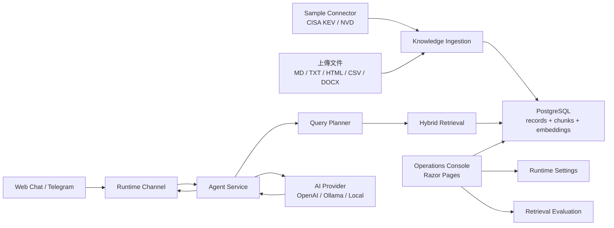

# RAG Agent Console

一個可以換領域的 RAG 問答 Agent，連同它的營運後台。

從文件匯入、切塊、建立向量、混合檢索到產生回答，整條 RAG pipeline 都在這個專案裡跑得起來；前面接 Web 對話與 Telegram，後面用一個 Dify 風格的後台管理知識庫、檢視檢索品質與調整設定。

為了讓它一啟動就有真實資料可以玩，repo 內建了一個資安連接器（CISA KEV / NVD）當作範例領域。但這只是範例——上傳 HR 政策、SOP、產品 FAQ、內部 memo 或任何 Markdown / TXT / HTML / CSV / DOCX，走的是同一套流程。

> Repository：`Bikerbyte/rag-agent-console`

---

## 為什麼做這個

市面上的 RAG demo 大多停在「丟一份 PDF，問一個問題」。我想做一個更接近正式產品的版本，把幾件平常會被跳過、但實際上線一定會遇到的事情補起來：

- **領域不該寫死。** 換一個產業就要重寫一套，不合理。這裡把「資料來源」和「RAG 引擎」拆開，換領域只需要換文件和 prompt。
- **檢索品質要看得到。** 回答好不好，問題常常出在檢索而不是生成。所以內建了一套 golden set 評估，直接量 Hit@1 / Hit@5 / MRR，而不是憑感覺。
- **要能真的部署。** 多節點、背景工作分工、leader lease、可觀測性（OpenTelemetry）、Docker 一鍵起，這些都做進去了。
- **不綁特定 AI 供應商。** OpenAI、Ollama（本機或外部 GPU），或完全不需要 API key 的本機備援，可以在後台直接切換。

---

## 功能一覽

- **知識庫管理**：上傳檔案後自動抽取文字、切塊、建立向量索引，可啟用/停用/重新索引單一文件。
- **混合檢索**：結合向量相似度與 BM25 關鍵字，支援中英混排的斷詞。
- **Agent 對話**：Web 與 Telegram 兩種入口，回覆附上檢索軌跡（用了哪些片段、分數多少）。
- **檢索評估**：對 Hybrid / Vector / Keyword 三種策略跑 golden set，並列比較。
- **營運後台**：節點心跳、推送與同步紀錄、Telegram 訂閱管理。
- **可設定**：Agent 名稱與各段 prompt、AI 供應商、向量庫、檢索參數都能在後台改，存進資料庫。
- **雙語介面**：整個後台支援繁體中文 / English 即時切換（預設繁中）。

---

## 架構



檢索的流程大致是：使用者提問 → planner 判斷要查什麼 → hybrid retrieval 從知識庫取出相關片段 → 把片段當 context 交給模型生成回答。沒命中知識庫時，會走一般回覆或本機備援。

---

## 技術棧

| 範圍 | 用了什麼 |
| --- | --- |
| Web / 後台 | ASP.NET Core Razor Pages |
| 資料存取 | Entity Framework Core |
| 儲存 | PostgreSQL（正式）/ in-memory（開發）|
| 向量檢索 | pgvector，另有 EF JSON fallback |
| 關鍵字檢索 | 自製 BM25 + 中英混排 tokenizer |
| 文件解析 | Semantic Kernel TextChunker、Markdig、HtmlAgilityPack、CsvHelper、OpenXml |
| 模型 | OpenAI / Ollama / 本機備援 |
| 可觀測性 | Serilog、OpenTelemetry |
| 通道 | Telegram Bot API、Web Chat |

---

## 快速開始

最低門檻，不需要資料庫也不需要 API key：

```bash
dotnet restore
dotnet run
```

預設用 in-memory database 與本機備援模型，開啟 `http://localhost:5166` 就能看到後台。

### 用 Docker

```bash
cp .env.example .env
docker compose up -d --build
```

Compose 會帶起 `pgvector/pgvector` 的 PostgreSQL。在 `.env` 選 AI 供應商；要啟用 pgvector 檢索就設 `VECTOR_STORE_PROVIDER=PgVector`。

### 接 PostgreSQL

```bash
dotnet user-secrets set "ConnectionStrings:DefaultConnection" "Host=localhost;Port=5432;Database=rag_agent_console;Username=postgres;Password=your-password"
dotnet ef database update
```

### 切換 AI 供應商

OpenAI：

```bash
dotnet user-secrets set "AiProvider:Provider" "OpenAI"
dotnet user-secrets set "AiProvider:EnableChatGeneration" "true"
dotnet user-secrets set "AiProvider:OpenAiApiKey" "sk-..."
```

Ollama（可指向外部 GPU 主機，例如 `http://192.168.1.20:11434`）：

```bash
ollama pull llama3.1 && ollama pull nomic-embed-text
dotnet user-secrets set "AiProvider:Provider" "Ollama"
dotnet user-secrets set "AiProvider:EnableChatGeneration" "true"
dotnet user-secrets set "AiProvider:OllamaApiBaseUrl" "http://localhost:11434"
```

以上都能改完直接在後台 **設定** 頁調整，不一定要走 user-secrets。

---

## 後台導覽

啟動後左側有六個區塊：

- **儀表板**：知識庫與系統狀態一覽。
- **知識庫**：上傳文件、同步範例資料、檢視單一文件內容範例、檢索測試。
- **對話**：直接測試 Agent，並展開檢索軌跡。
- **營運**：Telegram 訂閱、推送與同步紀錄、節點狀態。
- **檢索評估**：跑 golden set，比較三種檢索策略的 Hit@1 / Hit@5 / MRR。
- **設定**：Agent、AI 供應商、RAG、Telegram、背景工作。

---

## 試一份非資安文件

repo 附了一份範例文件：

```text
docs/demo-corpus/onboarding-policy.zh-TW.md
```

在「知識庫 → 匯入來源」上傳，模組選 `Internal Docs`，再到「檢索測試」查：

```text
遠端工作核准
新人前三十天目標
誰負責準備第一個任務
```

---

## 專案結構

```text
Data/                 EF Core DbContext
Models/               EF entity、options、view model
Pages/                Razor Pages 後台介面
Resources/            介面多語系資源（中 / 英）
Services/Agent/        Agent 回覆、RAG 檢索、AI client、query planner
Services/Advisories/   資安範例連接器、正規化、通知派送
Services/Knowledge/    通用文件匯入、文字抽取、chunking、embedding
Services/Telegram/     Telegram API、polling、webhook、update queue、push
Services/Runtime/      節點 heartbeat 與 leader lease
Services/Settings/     後台設定覆蓋（DB 優先，fallback 到 appsettings）
Evaluation/            golden set 測試案例
```

---

## 延伸閱讀

- [領域解耦設計筆記](docs/DomainDecoupling.zh-TW.md)
- [開源元件清單](docs/OpenSourceComponents.zh-TW.md)
