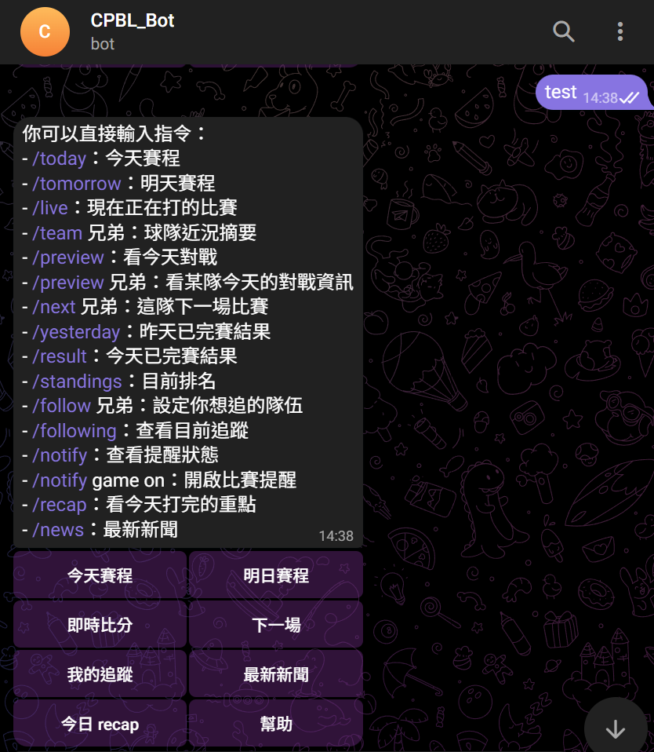
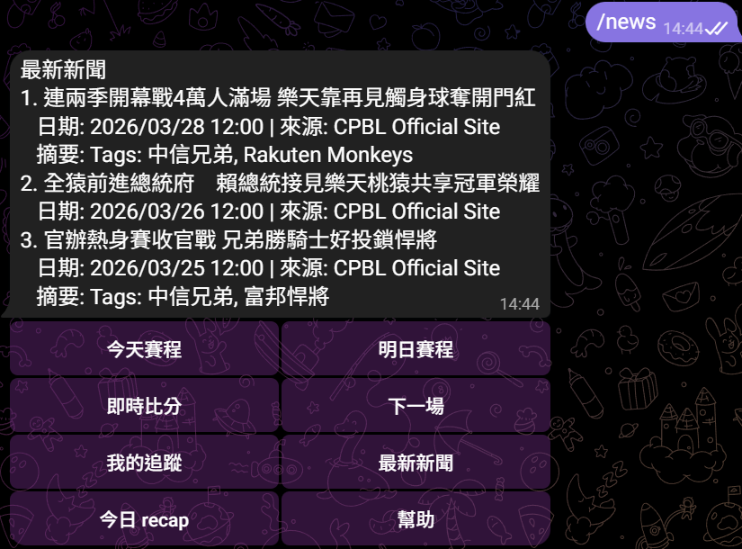
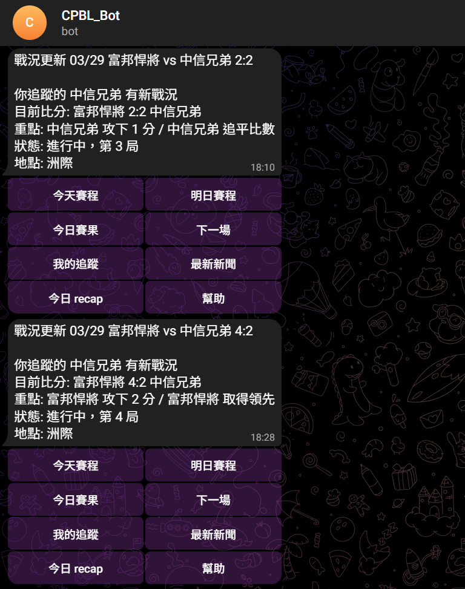

# CPBL Telegram Assistant

這是一個 CPBL 中華職棒 Telegram bot，讓使用者能快速掌握比賽資訊，目前提供以下功能：
- 查今天賽程、明天賽程
- 查即時比分與今日對戰資訊
- 查某支球隊的近況與下一場比賽
- 查昨天賽果、今天已完賽結果、目前排名
- 追蹤喜歡的球隊，接收開賽、終場、新聞等提醒
- 查看最新中職新聞
- 賽後用簡短文字整理當日重點

主要指令如下，另外也支援部分口語化詢問：
- /today：今天賽程、包含進行中比賽戰況
- /tomorrow：明天賽程
- /yesterday：昨天已完賽結果
- /result：今天已完賽結果
- /standings：目前排名
- /follow 兄弟：設定你想追的隊伍
- /following：查看目前追蹤
- /team 兄弟：球隊近況摘要
- /next 兄弟：這隊下一場比賽
- /notify：查看提醒狀態
- /notify game on：開啟比賽提醒
- /recap：看今天打完的重點
- /news：最新新聞


## Demo 

- 互動視窗



- 及時戰況更新



## 資料庫

PostgreSQL：
```powershell
dotnet user-secrets set "ConnectionStrings:DefaultConnection" "Host=localhost;Port=5432;Database=cpbl_telegram_assistant;Username=postgres;Password=your-password"
```

## Telegram 設定

先把 bot token 放進 user-secrets：
```powershell
dotnet user-secrets set "TelegramBot:Enabled" "true"
dotnet user-secrets set "TelegramBot:BotToken" "your-bot-token"
```
