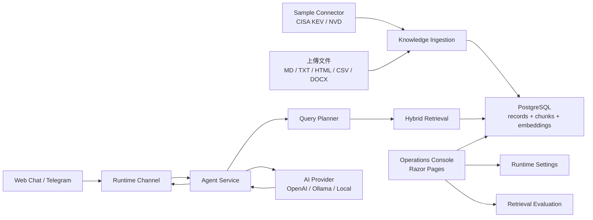

# RAG Agent Console

一個可以換領域的 RAG 問答 Agent，外加一套自己的營運後台。

整條 pipeline 都在這個 repo 裡：文件匯入、切塊、建立向量、混合檢索，再交給模型生成回答。對外有 Web 對話和 Telegram 兩個入口，對內是一個 Dify 風格的後台，用來管理知識庫、看檢索品質、調設定。

預設內建一個資安連接器（CISA KEV / NVD），一啟動就有公開資料可以測。但領域沒有寫死——上傳 HR 政策、SOP、產品 FAQ，或任何 Markdown / TXT / HTML / CSV / DOCX，走的是同一套流程。

## 想解決的問題

大部分 RAG 範例做到「丟一份 PDF、問一個問題」就停了。我想做得再往產品靠一點，所以特別處理了幾件實際上線會遇到、但 demo 常常跳過的事。

資料來源和檢索引擎是分開的，換領域只要換文件和 prompt，不用動程式。檢索品質背後有一組 golden set 在跑，直接量 Hit@1 / Hit@5 / MRR，而不是憑感覺說「好像有比較準」。模型供應商可以在後台切 OpenAI、Ollama 或本機備援，連 API key 都沒有也能跑起來。部署會碰到的東西——多節點、背景工作分工、leader lease、OpenTelemetry、Docker——也都接好了。

## 功能

- 知識庫：上傳檔案後自動抽取、切塊、建立向量索引，單一文件能啟用、停用、重新索引。
- 混合檢索：向量相似度加 BM25 關鍵字，斷詞支援中英混排。
- Agent 對話：Web 與 Telegram，回覆附上檢索軌跡（用了哪些片段、分數多少）。
- 檢索評估：Hybrid / Vector / Keyword 三種策略各跑一次 golden set，並列比較。
- 後台：節點狀態、推送與同步紀錄、Telegram 訂閱，以及 Agent prompt、供應商、檢索參數的設定（都存資料庫）。
- 介面繁中 / English 即時切換。

## 架構



一次問答大致是：使用者提問，planner 先判斷要查什麼，hybrid retrieval 從知識庫撈出相關片段，再把片段當 context 交給模型生成回答；沒命中知識庫時走一般回覆或本機備援。

## 技術棧

| 範圍 | 用了什麼 |
| --- | --- |
| Web / 後台 | ASP.NET Core Razor Pages |
| 資料存取 | Entity Framework Core |
| 儲存 | PostgreSQL（正式）/ in-memory（開發） |
| 向量檢索 | pgvector，另有 EF JSON fallback |
| 關鍵字檢索 | 自製 BM25 + 中英混排 tokenizer |
| 文件解析 | Semantic Kernel TextChunker、Markdig、HtmlAgilityPack、CsvHelper、OpenXml |
| 模型 | OpenAI / Ollama / 本機備援 |
| 可觀測性 | Serilog、OpenTelemetry |
| 對外通道 | Telegram Bot API、Web Chat |

## 跑起來

最低門檻，不用資料庫也不用 API key：

```bash
dotnet restore
dotnet run
```

預設用 in-memory database 加本機備援模型，開 `http://localhost:5166` 就能看到後台。想試非資安情境，repo 附了一份 `docs/demo-corpus/onboarding-policy.zh-TW.md`，在「知識庫 → 匯入來源」上傳、module 選 `Internal Docs`，再到「檢索測試」查就行。

要正式一點，可以接 PostgreSQL：

```bash
dotnet user-secrets set "ConnectionStrings:DefaultConnection" "Host=localhost;Port=5432;Database=rag_agent_console;Username=postgres;Password=your-password"
dotnet ef database update
```

或用 Docker 一次帶起站台和 pgvector：

```bash
cp .env.example .env
docker compose up -d --build
```

`.env` 裡選供應商，要用 pgvector 檢索就設 `VECTOR_STORE_PROVIDER=PgVector`。模型供應商（OpenAI / Ollama / 本機）這些都能直接在後台「設定」頁改，不一定要走 user-secrets；Ollama 也可以指到外部 GPU 主機，例如 `http://192.168.1.20:11434`。

## 專案結構

```text
Data/                EF Core DbContext
Models/              EF entity、options、view model
Pages/               Razor Pages 後台
Resources/           介面多語系資源（中 / 英）
Services/Agent/       Agent 回覆、RAG 檢索、AI client、query planner
Services/Advisories/  資安範例連接器、正規化、通知派送
Services/Knowledge/   通用文件匯入、文字抽取、chunking、embedding
Services/Telegram/    Telegram API、polling、webhook、update queue、push
Services/Runtime/     節點 heartbeat 與 leader lease
Services/Settings/    後台設定覆蓋（DB 優先，fallback 到 appsettings）
Evaluation/          golden set 測試案例
```

設計上怎麼把資安耦合拆掉，另外寫在 [docs/DomainDecoupling.zh-TW.md](docs/DomainDecoupling.zh-TW.md)。
