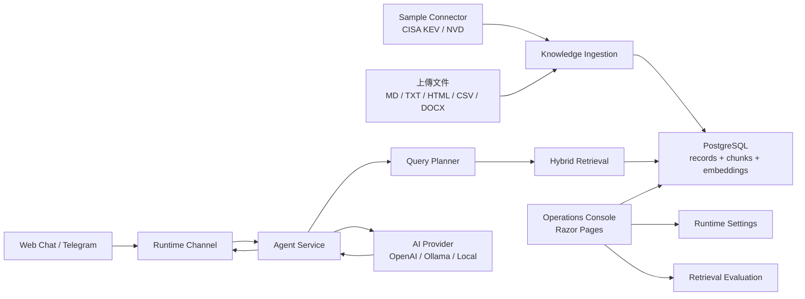

# RAG Agent Console

一個 RAG AI Agent 框架，可依照需求自由調整知識庫內容，成為不同用途的 AI Agent。

Pipeline 如下：文件匯入、切塊、建立向量、混合檢索，再交給模型生成回答。 
對外有 Web 對話和 Telegram 兩個入口，對內帶有管理後台，用來管理知識庫、看檢索品質、調設定。

預設內建一個資安連接器（CISA KEV / NVD），用來收集資安相關情報。 
但可依目的更改領域，E.g. 上傳 HR 政策、作業SOP、產品 FAQ、OI等，支援 Markdown / TXT / HTML / CSV / DOCX 等常用格式。

框架核心（匯入、切塊、向量／BM25 混合檢索、Query Planner、回答生成、檢索軌跡、評估）是領域中立的；
領域相關的行為（計畫正規化、context 組裝、trace metadata）由可插拔的 `IRagDomain` 模組提供。
內建的 `SecurityAdvisoryDomain` 示範如何接上領域資料來源（CISA KEV / NVD）、加上領域 metadata 與評估案例；
要做 HR 政策、SOP、產品 FAQ 等助理，替換知識庫文件、prompt 與（選配的）domain 模組即可。

## 功能

分開的資料來源和檢索引擎，換領域只要換知識庫文件和 prompt，不用動程式。 

- 知識庫：上傳檔案（支援批次）後自動抽取、切塊、建立向量索引，單一文件能啟用、停用、重新索引。
- 混合檢索：向量相似度加 BM25 關鍵字，斷詞支援中英混排。
- Query Planner：由 LLM 做意圖解析、時間範圍、模組選擇。
- Agent 對話：Web 與 Telegram，回覆附上檢索軌跡（用了哪些片段、分數多少）。
- 檢索評估：可在後台新增/編輯評估案例（內建 golden set 為種子），對 Hybrid / Vector / Keyword 三種策略並列比較 Hit@1 / Hit@5 / MRR。
- 後台：節點狀態、推送與同步紀錄、Telegram 訂閱，以及 Agent prompt、供應商、檢索參數的設定（都存資料庫）。

## 架構



## 使用技術

| 範圍 | 工具 |
| --- | --- |
| Web / 後台 | ASP.NET Core |
| 資料存取 | Entity Framework Core |
| 儲存 | PostgreSQL（正式） |
| 向量檢索 | pgvector (PostgreSQL plugin) |
| 關鍵字檢索 | 自製 BM25 + 中英混排 tokenizer |
| 文件解析 | Semantic Kernel TextChunker、Markdig、HtmlAgilityPack、CsvHelper、OpenXml |
| 模型 | OpenAI (API Key) / Ollama (Local Hosted)|
| 可觀測性 | Serilog、OpenTelemetry |
| 對外通道 | Telegram Bot API、Web Chat |

## Demo


## 開始方式

```bash
dotnet restore
dotnet run
```

預設用 in-memory database，後台預設為 `http://localhost:5166` 。  
需要先到「設定 → AI 供應商」選擇 Provider 並開啟「回答生成」，Query Planner 與對話皆需要 AI 模型。  
想試非資安情境，repo 的 `docs/demo-corpus/onboarding-policy.zh-TW.md`，在「知識庫 → 匯入來源」上傳、module 選 `Internal Docs`，再進行「檢索測試」。

接 PostgreSQL：

```bash
dotnet user-secrets set "ConnectionStrings:DefaultConnection" "Host=localhost;Port=5432;Database=rag_agent_console;Username=postgres;Password=your-password"
dotnet ef database update
```

或 Docker 一次起動站台和 pgvector：

```bash
cp .env.example .env
docker compose up -d --build
```

`.env` 裡選 Model provider，要用 pgvector 檢索就設 `VECTOR_STORE_PROVIDER=PgVector`。模型供應商（OpenAI / Ollama / 本機）這些都能直接在後台「設定」頁改，不一定要走 user-secrets；Ollama 也可以指到外部 GPU 主機，例如 `http://192.168.1.20:11434`。

## 專案結構

```text
Data/                EF Core DbContext
Models/              EF entity、options、view model
Pages/               Razor Pages 後台
Resources/           介面多語系資源（中 / 英）
Services/Agent/       Agent 回覆、RAG 檢索、AI client、query planner
Services/Advisories/  資安範例連接器、正規化、通知派送
Services/Knowledge/   通用文件匯入、文字抽取、chunking、embedding
Services/Telegram/    Telegram API、polling、webhook、update queue、push
Services/Runtime/     節點 heartbeat 與 leader lease
Services/Settings/    後台設定覆蓋（DB 優先，fallback 到 appsettings）
Evaluation/          golden set 種子（啟動灌入後可在後台編輯）
```
