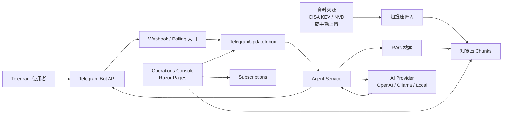

# Advisory Bot

Advisory Bot 是一個以 Telegram 為主要入口的模組化 RAG Agent 框架。核心設計目標是：**換掉資料來源和文件，就能切換應用領域**，不需要動 Agent 邏輯或 RAG pipeline。

目前預設部署為資安弱點助理（CVE / CISA KEV），但 Agent 名稱、系統提示詞、知識庫內容和 AI planner prompt 都可以從設定頁面直接調整。

## 專案定位

- Telegram 是主要互動介面，Operations Console 提供後台管理。
- 使用者以自然語言提問，Agent 透過 RAG 從知識庫找到相關內容後回答。
- AI Provider 可切換 OpenAI API、Ollama 本機模型，或不依賴 API key 的 local fallback。
- 知識庫支援官方資料來源同步和手動文件上傳（PDF、DOCX、CSV、Markdown、HTML、純文字）。
- Agent 名稱、planner prompt、RAG system prompt 和 chat placeholder 都可從 Settings 頁面動態調整，不需重啟。

## 架構



## 專案檔案結構

```text
Data/                 EF Core DbContext
Models/               EF entity、options、view model
Pages/                Razor Pages 後台介面
Services/Agent/       Agent 回覆、RAG retrieval、AI provider client、query planner
Services/Advisories/  資料來源同步、正規化、通知派送
Services/Knowledge/   文件匯入、chunking、embedding
Services/Telegram/    Telegram API、polling、webhook、update queue、push
Services/Runtime/     節點 heartbeat 與 leadership lease
Services/Settings/    後台設定覆蓋（DB 優先，fallback 到 appsettings）
Services/Contracts/   依領域分組的 service interface
```

## RAG 模組化結構

```text
資料來源          官方 connector（CISA KEV / NVD）或手動文件上傳
知識庫匯入        KnowledgeDocumentIngestionService
Embedding         OpenAI / Ollama / local hash provider
Vector store      IAdvisoryVectorStore：EfJson（預設）或 PgVector
Query planner     LocalAdvisoryQueryPlanner（heuristic）
                  ResilientAdvisoryQueryPlanner（AI → local fallback）
Retriever         SecurityAdvisorySearchService（hybrid retrieval + re-ranking）
Answer composer   SecurityAdvisoryAnswerService（RAG context + AI generation）
Runtime channel   Telegram / Operations Console Web Chat
```

## 使用的開源與外部元件

- ASP.NET Core / Razor Pages：Web app 與營運後台
- Entity Framework Core：資料存取
- PostgreSQL：正式環境儲存
- pgvector：PostgreSQL 向量檢索 extension
- Microsoft Semantic Kernel TextChunker：通用文件 chunking
- Markdig：Markdown 文字抽取
- HtmlAgilityPack：HTML 文字抽取
- CsvHelper：CSV 文字抽取
- DocumentFormat.OpenXml：DOCX 文字抽取
- Serilog：結構化 application logging
- OpenTelemetry：HTTP / runtime tracing 與 metrics 掛點
- Telegram Bot API：聊天入口與回覆推送
- Ollama：本機 LLM 與 embedding 模型
- OpenAI API：可選用的雲端模型 provider

## AI Provider 設定

預設是 local fallback，不需要 API key，適合本機開發：

```json
"AiProvider": {
  "Provider": "Local",
  "EnableChatGeneration": false,
  "UseLocalFallback": true
}
```

OpenAI 模式：

```powershell
dotnet user-secrets set "AiProvider:Provider" "OpenAI"
dotnet user-secrets set "AiProvider:EnableChatGeneration" "true"
dotnet user-secrets set "AiProvider:OpenAiApiKey" "sk-..."
dotnet user-secrets set "AiProvider:OpenAiChatModel" "gpt-4o-mini"
dotnet user-secrets set "AiProvider:OpenAiEmbeddingModel" "text-embedding-3-small"
```

Ollama 模式：

```powershell
ollama pull llama3.1
ollama pull nomic-embed-text
dotnet user-secrets set "AiProvider:Provider" "Ollama"
dotnet user-secrets set "AiProvider:EnableChatGeneration" "true"
dotnet user-secrets set "AiProvider:OllamaApiBaseUrl" "http://localhost:11434"
dotnet user-secrets set "AiProvider:OllamaChatModel" "llama3.1"
dotnet user-secrets set "AiProvider:OllamaEmbeddingModel" "nomic-embed-text"
```

## 本機執行

```powershell
dotnet restore
dotnet run
```

預設沒有設定 connection string 時，使用 in-memory database。

若要使用 PostgreSQL：

```powershell
dotnet user-secrets set "ConnectionStrings:DefaultConnection" "Host=localhost;Port=5432;Database=advisory_bot;Username=postgres;Password=your-password"
dotnet ef database update
```

若要啟用 Telegram：

```powershell
dotnet user-secrets set "TelegramBot:Enabled" "true"
dotnet user-secrets set "TelegramBot:BotToken" "your-bot-token"
```

本機 polling 模式：

```powershell
dotnet user-secrets set "TelegramBot:UseWebhookMode" "false"
dotnet user-secrets set "AppRuntime:Profile" "PollingNode"
```

## Operations Console

啟動後開啟 `http://localhost:5166`（或 launchSettings.json 指定的 port）。

- **Dashboard**：知識庫與系統狀態一覽
- **Knowledge Base**：資料來源同步、手動文件上傳、retrieval 測試
- **Chat**：直接測試 Agent 對話
- **Operations**：Telegram 訂閱管理、推播與同步 log、節點狀態
- **Settings**：AI provider、Agent 名稱/提示詞、RAG、Telegram、排程、Observability

## Docker

```bash
cp .env.example .env
docker compose up -d --build
```

Docker Compose 的 PostgreSQL 服務使用 `pgvector/pgvector:0.8.2-pg17-trixie`。在 `.env` 選擇 OpenAI、Ollama 或 Local fallback；若要啟用 pgvector retrieval，設定 `VECTOR_STORE_PROVIDER=PgVector`。

## 相關文件

- [開源元件使用清單](docs/OpenSourceComponents.zh-TW.md)
