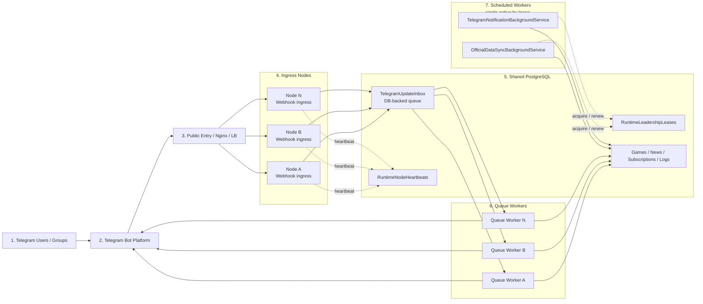

# CPBL Telegram Assistant 可擴展多節點架構

這份說明刻意對齊目前 repo 已經落地的版本，不用固定 master node，而是：

- same codebase
- multi-node deployment by runtime roles
- scheduled jobs use lease-based single-active execution

---

## 架構重點

### 1. 同一份程式可部署到多台 VM

每台節點都跑同一份 ASP.NET Core 應用程式，再透過 `AppRuntime` 設定決定：

- 是否啟用 `Webhook ingress`
- 是否啟用 `Telegram update queue worker`
- 是否具備 `OfficialDataSync worker` 執行資格
- 是否具備 `TelegramNotification worker` 執行資格

這是 **role-based deployment**，不是固定 master / worker 拓樸。

### 2. Telegram request 與實際處理拆開

對外進來的 Telegram webhook 會先進到 ingress node，之後寫入共享的 `TelegramUpdateInbox`。

後續再由多個 queue worker 節點協作處理：

- claim batch
- processing
- retry / failed
- 回覆 Telegram

這一層維持多節點協作，不使用 leader-only 模式。

### 3. Scheduled jobs 改成 lease-based single-active execution

以下兩個 background service 不再靠人為指定哪台是 primary：

- `OfficialDataSyncBackgroundService`
- `TelegramNotificationBackgroundService`

現在是符合資格的節點都能嘗試搶租約，但同一時間只有一台能持有：

- `OfficialDataSync`
- `TelegramNotification`

如果持有租約的節點掛掉：

- lease 到期
- 其他節點重新 acquire
- 系統自動接手

### 4. PostgreSQL 不只存業務資料，也存 runtime 狀態

目前 PostgreSQL 會保存：

- 業務資料：`Teams`、`Games`、`NewsItems`、`TelegramChatSubscriptions`
- queue 狀態：`TelegramUpdateInboxes`
- node 心跳：`RuntimeNodeHeartbeats`
- leadership lease：`RuntimeLeadershipLeases`
- log：`PushLogs`、`SyncJobLogs`

---

## Mermaid 架構圖

---

## 實際運作方式

### A. Webhook / Queue 路徑

1. Telegram 把 update 打到任一 ingress node  
2. ingress node 驗證 webhook 後，把 update 寫入 `TelegramUpdateInbox`  
3. 任一 queue worker 都可以 claim 該筆 update  
4. worker 執行 command reply / push / DB 寫入  
5. 最後回 Telegram Bot API

### B. Scheduled jobs 路徑

1. 具備 worker 資格的節點嘗試 acquire 或 renew leadership lease  
2. 只有拿到 lease 的節點才會真正跑 sync / notification  
3. 其他節點保持待命並定期 retry  
4. 若 leader 掛掉，租約到期後由其他節點 takeover

---

## 現在可以怎麼部署

### 單台模式

- webhook ingress：開
- update queue worker：開
- official sync worker：開
- notification worker：開
- leadership lease：可開可關，開著也能正常跑

### 多台模式

所有節點都可以開：

- webhook ingress
- update queue worker

若你想要更高可用，也可以讓多台節點都具備：

- official sync worker 資格
- notification worker 資格

最後由資料庫 lease 決定誰當前真正執行 scheduled jobs，而不是手動指定固定 primary。

---

## 面試時可怎麼描述

可以用這樣的說法：

> 這個專案維持單一 codebase，但支援多節點部署。  
> Telegram webhook 與 update processing 之間用 DB-backed queue 拆開，讓 ingress 與 queue worker 可以水平擴展。  
> 排程型工作則不是靠固定 master node，而是用 PostgreSQL leadership lease 做 single-active execution。  
> 所以系統既能擴展 request / queue throughput，也能避免 sync 與通知工作在多節點下重複執行。
